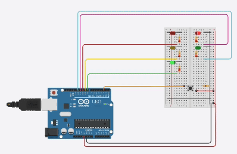
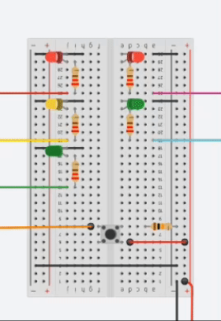
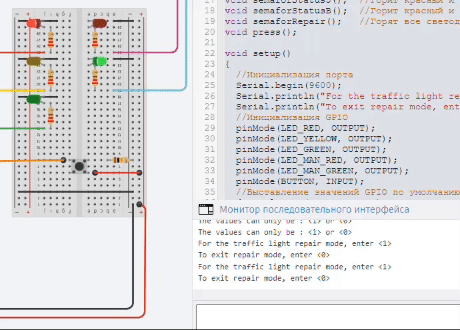

### Работа светофора в штатном режиме.

- Состояние 1 : Зеленый горит 3 секунды, пешеходу горит красный
- Состояние 2 : Зеленый моргает 3 раза по 0.5 секунды
- Состояние 3 : Желтый горит 1.5 секунды
- Состояние 4 : Загорается красный на 3 секунды и пешеходу загорается зеленый
- Состояние 5 : Загорается желтый и горит красный, пешеходу - красный. 1.5 секунды

### Обработка нажатия кнопки.

При нажатии кнопки происходит прерывание и вызывается функция press();
Происходит смена состояния переменной isPressed, которая используется в цикле программы. 
Это условие меняет время задержки состояния 4 с трех, на восемь секунд.
Повторное нажатие кнопки ничего не дает, пока светофор не отработает весь цикл и "не пропустит машины со светофора".
Так же, эта реализация не вызывает резкое переключение с зеленого на красный.

### Работа с монитором последовательного интерфейса
При запуске монитора в него поступает небольшая инструкция, какими командами включить и выключить светодиоды.
Командой "1" включаются все светодиоды и горят пона не поступает команда "0". Если ввести неправильную команду, в монитор поступит напоминание.
При команде "0", светофор включает штатный режим работы.

1. Пытался заменить delay() на millis(), но возникли сложности с переносом в функции и получалось довольно громоздко. Поэтому оставил delay(). 
2. А так же, к сожалению не придумал, как при вводе команды "1" прекратить цикл работы светофора. Поэтому она срабатывает только, после прохода всего loop().
3. В этом скетче попытался объединить сразу все три задания. Поэтому немного отошел от условия, но в общем, логику работы светофора не нарушил.